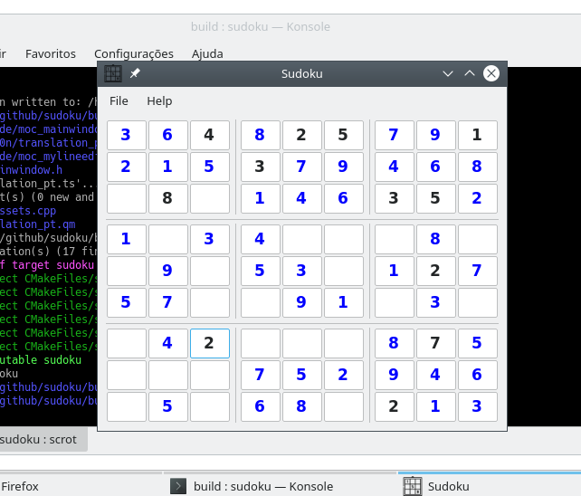

# Simple Sudoku

This is a simple Sudoku Puzzle game made with C++ and QT

# Requirements
  - C++17 compiler support
  
  - Qt5

# Build and Run
    mkdir -p build
    cd build
    cmake ..
    make
    ./sudoku
    
    If you really liked -> sudo make install

